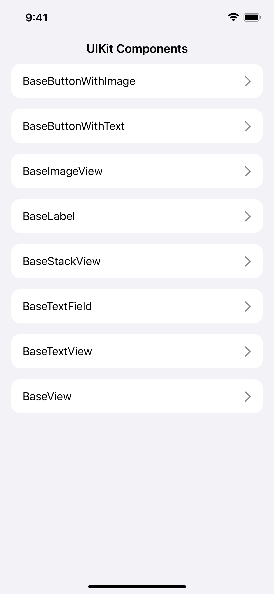

# UIKit Components Package

This repository contains basic components for setting up UIKit components programmatically.

It is made by **[SPACE SQUAD](https://www.spacesquad.de)**! We make great software with ♥️ in Berlin.

---

## Content
- [Features](#features)
- [Screenshots](#screenshots)
- [Installation](#installation)
- [How to Use](#how-to-use)

## Features
This package contains extensions for easily setting up AutoLayout as well as basic components to simplify initializing programmatic UI components with UIKit.

**Extensions**
- [x] Constraining components (with optional custom padding)
- [x] Constrain views to fill their superview (with optional custom padding)
- [x] Constrain a view as a square
- [x] Set width or height of a views
- [x] Set inner padding for a UITextField

**Components**
- [x] BaseNavigationController (to easily override status bar color)
- [x] BaseCollectionViewController (to support Flow Layout and orientation change on iPad)
- [x] BaseButtonWithImage
- [x] BaseButtonWithText
- [x] BaseImageView
- [x] BaseLabel
- [x] BaseStackView
- [x] BaseTextField
- [x] BaseTextView
- [x] BaseView

## Screenshots

## Installation
##### Requirements
- iOS 15.0+
- Xcode 13+
- Swift 5+

##### Swift Package Manager
In Xcode, go to `File > Add Packages` and add `https://github.com/space-squad/uikit-components`. Add the package to all your targets.

## How to Use
Extensions and components can be accessed by declaring `import UIKitComponents` on top of your file. All components are named after the same schema, like `Base<Component>`. To see available components, check out the list above, look at the appended screenshot or check out the example project. There is no further setup needed.

All views have custom initializers to set properties of your view, some of which are required. Please check our example project on how to implement the components and use the extensions.

In addition, we added custom delegates to **BaseTextView** and **BaseTextField** to support subscribing to whether they are currently in editing mode and to continously read the user's input. See the example code on how to subscribe to their values using the Combine framework.
